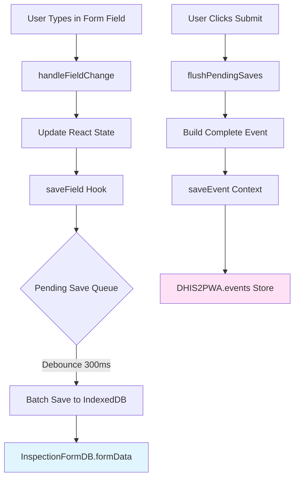
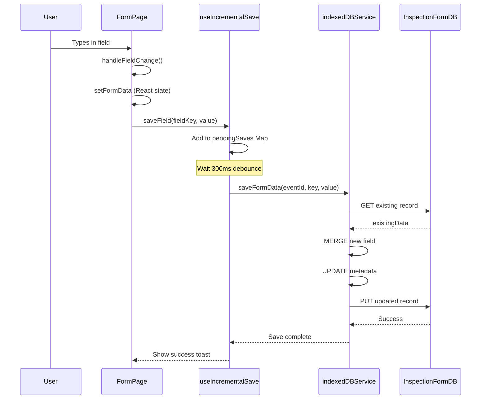
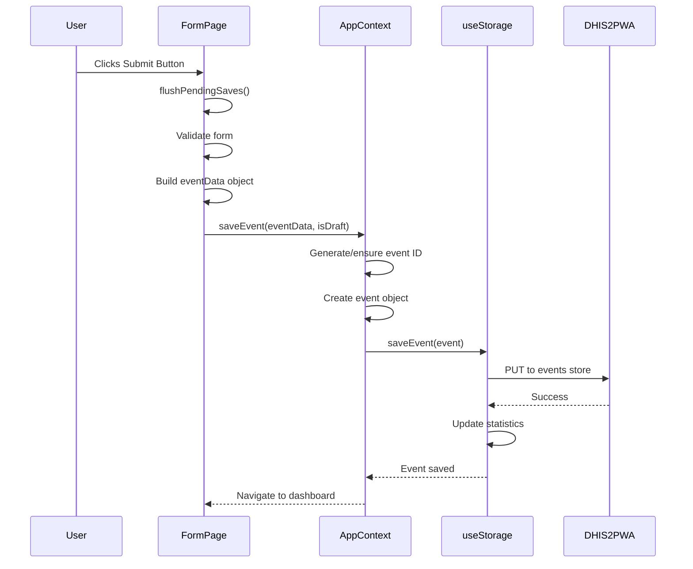
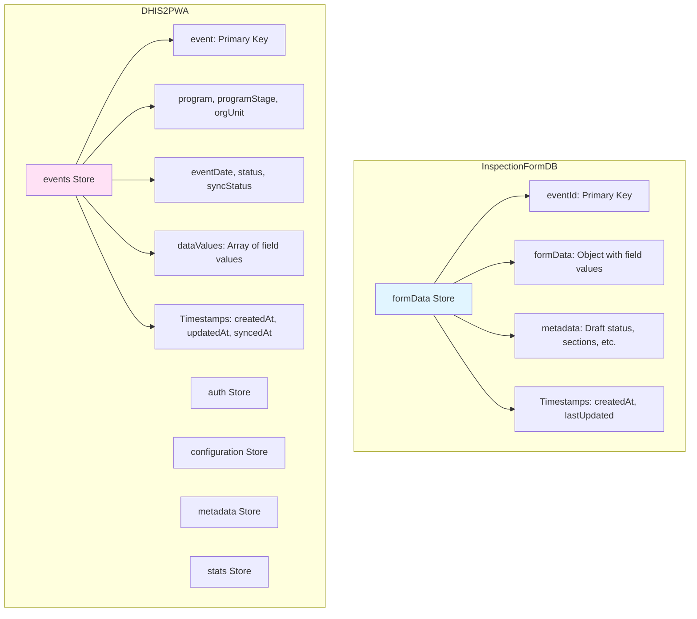
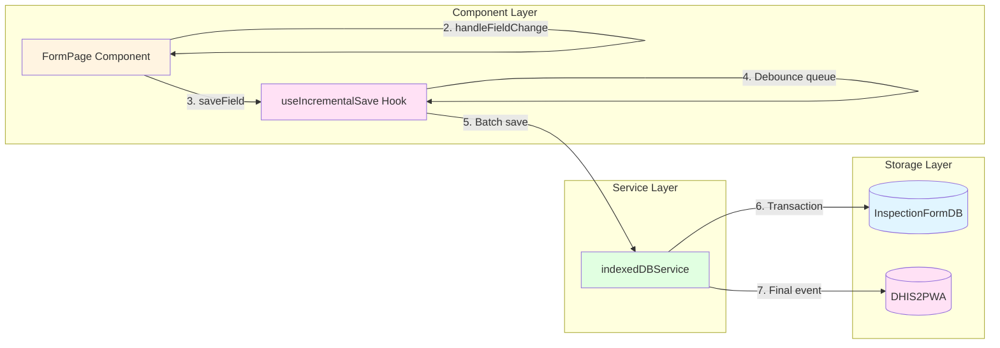
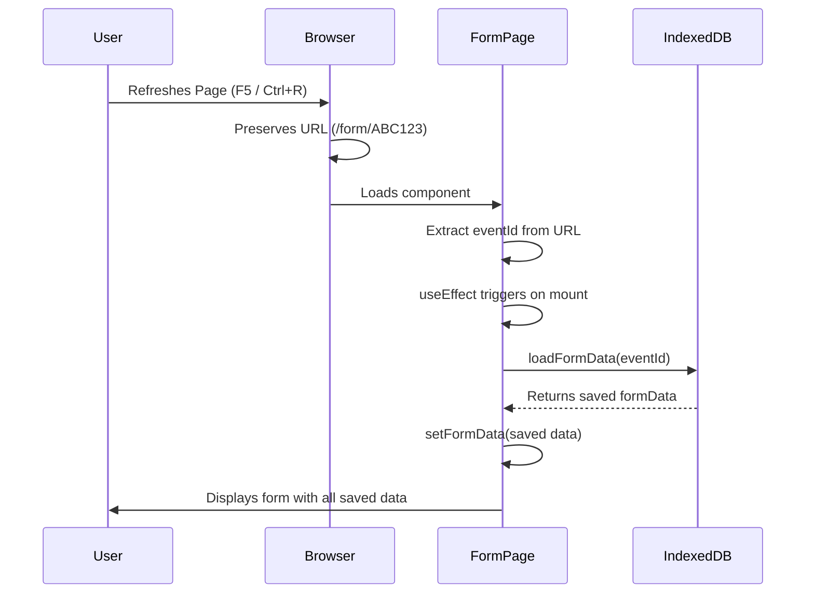

# 📊 Record Save and Storage Flow Documentation

This document maps out how inspection records are saved and stored locally in the PWA application.

## 📊 Visual Flow Diagrams

### Complete Save Flow (Overview)



### Real-Time Incremental Saving Flow



### Final Event Save Flow



### Database Structure Overview



### Data Flow: Field Change to Storage



### Save Triggers & Timing

```mermaid
gantt
    title Save Operations Timeline
    dateFormat X
    axisFormat %L ms
    
    section User Types
    Field Change Event    :0, 10
    React State Update    :10, 20
    Queue in Hook         :20, 30
    
    section Debounced Save
    Wait Period           :30, 330
    Batch Processing      :330, 360
    IndexedDB Write       :360, 400
    
    section Form Submit
    Flush Pending         :400, 430
    Validation            :430, 450
    Build Event           :450, 480
    Final Save            :480, 520
```



## 🗂️ Storage Architecture Overview

The application uses **multiple IndexedDB databases** for different purposes:

### 1. **InspectionFormDB** (Incremental Field-by-Field Saving)
- **Database Name:** `InspectionFormDB`
- **Store:** `formData`
- **Purpose:** Real-time incremental saving of form fields as user types
- **Key Structure:** `eventId` (primary key)

### 2. **DHIS2PWA** (Event Storage & Sync)
- **Database Name:** `DHIS2PWA`
- **Stores:** `events`, `auth`, `configuration`, `metadata`, `stats`
- **Purpose:** Final event storage, authentication, configuration, and sync management
- **Key Structure:** `event` (eventId) for events store

### 3. **QIMSInspectionDB** (Legacy/Alternative)
- **Database Name:** `QIMSInspectionDB`
- **Stores:** `assignments`, `inspections`
- **Purpose:** Assignment and inspection tracking (alternative implementation)

---

## 🔄 Complete Save Flow

### **Phase 1: Real-Time Incremental Saving (As User Types)**

```
User Types in Field
       ↓
handleFieldChange() called (FormPage.jsx:4883)
       ↓
setFormData() - Updates React state
       ↓
saveField(fieldName, value) - useIncrementalSave hook (FormPage.jsx:4885)
       ↓
Field added to pendingSaves Map (debounced queue)
       ↓
[Wait 300ms debounce]
       ↓
debouncedSave() triggered
       ↓
For each pending field:
  indexedDBService.saveFormData(eventId, fieldKey, fieldValue)
       ↓
IndexedDB Transaction: InspectionFormDB → formData store
       ↓
GET existing record by eventId
       ↓
MERGE new field into existingData.formData
       ↓
UPDATE metadata (lastFieldUpdated, updateCount, timestamp)
       ↓
PUT updated record back to IndexedDB
       ↓
✅ Field saved to InspectionFormDB
```

### **Phase 2: Form Submission (Final Save)**

```
User Clicks "Submit Inspection" Button
       ↓
handleSubmit() called (FormPage.jsx:5240)
       ↓
flushPendingSaves() - Ensures all debounced saves complete
       ↓
Validation checks (signature, required fields)
       ↓
Build complete eventData object from formData
       ↓
saveEvent(eventData, saveDraft) - AppContext.jsx:762
       ↓
Generate/ensure DHIS2 event ID (11 chars: letter + 10 alphanumeric)
       ↓
Create event object with:
  - event: eventId
  - program, programStage, orgUnit
  - eventDate, status, syncStatus
  - dataValues: [array of {dataElement, value}]
  - createdAt, updatedAt timestamps
       ↓
storage.saveEvent(event) - useStorage.js:172
       ↓
IndexedDB Transaction: DHIS2PWA → events store
       ↓
PUT event record (eventId as key)
       ↓
updateStats() - Updates statistics
       ↓
✅ Event saved to DHIS2PWA database
       ↓
Navigate to dashboard (/home)
```

---

## 📁 Data Structures

### **InspectionFormDB.formData Store Structure**

```javascript
{
  eventId: "ABC123XYZ45",           // Primary key
  formData: {                        // All field values
    "dataElement_qfmVD6tCOHu": "value1",
    "dataElement_ABC123": "value2",
    "comment_dataElement_XYZ": "comment text",
    "orgUnit": "facility-id",
    "eventDate": "2025-01-15"
  },
  metadata: {
    isDraft: true,                   // Draft status
    currentSection: "Inspection Information",
    completedSections: ["Section 1"],
    lastFieldUpdated: "dataElement_qfmVD6tCOHu",
    updateCount: 15,                 // Number of field updates
    fieldComments: {},               // Comments per field
    lastSectionUpdate: "2025-01-15T10:30:00Z"
  },
  createdAt: "2025-01-15T10:00:00Z",
  lastUpdated: "2025-01-15T10:05:30Z"
}
```

### **DHIS2PWA.events Store Structure**

```javascript
{
  event: "ABC123XYZ45",              // Primary key (DHIS2 event ID)
  program: "program-id",
  programStage: "program-stage-id",
  orgUnit: "org-unit-id",
  eventDate: "2025-01-15",
  status: "ACTIVE",                  // ACTIVE, COMPLETED, etc.
  syncStatus: "pending",             // pending, synced, error
  dataValues: [
    {
      dataElement: "dataElement-id-1",
      value: "field-value-1"
    },
    {
      dataElement: "dataElement-id-2",
      value: "field-value-2"
    }
  ],
  createdAt: "2025-01-15T10:00:00Z",
  updatedAt: "2025-01-15T10:30:00Z",
  syncedAt: null                     // Set when successfully synced
}
```

---

## 🎯 Key Components

### **1. useIncrementalSave Hook** (`src/hooks/useIncrementalSave.js`)

**Purpose:** Provides debounced field-by-field saving

**Key Functions:**
- `saveField(fieldKey, fieldValue)` - Debounced save (300ms default)
- `saveFieldImmediate(fieldKey, fieldValue)` - Immediate save (no debounce)
- `loadFormData()` - Load existing form data from IndexedDB
- `flushPendingSaves()` - Force save all pending changes

**How it works:**
- Maintains a `pendingSaves` Map to batch field updates
- Uses setTimeout debouncing (300ms) to avoid excessive writes
- Saves each field individually to maintain incremental approach
- Automatically initializes IndexedDB connection

### **2. indexedDBService** (`src/services/indexedDBService.js`)

**Purpose:** Core database operations for incremental saving

**Key Functions:**
- `saveFormData(eventId, fieldKey, fieldValue, metadata)` - Save single field
- `getFormData(eventId)` - Retrieve complete form data
- `saveCompleteFormData(eventId, formData, metadata)` - Bulk save
- `markAsSubmitted(eventId)` - Mark draft as submitted

**Database:** InspectionFormDB

### **3. useStorage Hook** (`src/hooks/useStorage.js`)

**Purpose:** Event storage and sync management

**Key Functions:**
- `saveEvent(eventData)` - Save final event
- `updateEvent(eventId, updates)` - Update existing event
- `getEvent(eventId)` - Retrieve event
- `getEvents(filter)` - Query events by status/syncStatus

**Database:** DHIS2PWA

### **4. AppContext.saveEvent** (`src/contexts/AppContext.jsx`)

**Purpose:** High-level event saving with ID generation

**Features:**
- Generates DHIS2-compliant event IDs (11 characters)
- Sets status and syncStatus
- Updates statistics
- Shows toast notifications
- Handles errors gracefully

---

## 🔍 Save Triggers

### **Automatic Saves (Real-Time)**
1. **Field Changes** - Every keystroke/selection triggers `saveField()`
   - Location: `FormPage.jsx:4885`
   - Debounce: 300ms
   - Storage: InspectionFormDB

2. **Critical Fields** - Immediate save (no debounce)
   - Signatures: `saveFieldImmediate('intervieweeSignature', ...)`
   - Location: `FormPage.jsx:3848`
   - Storage: InspectionFormDB

### **Manual Saves**
1. **Form Submission** - Final save to events store
   - Location: `FormPage.jsx:5216`
   - Function: `saveEvent(eventData, saveDraft)`
   - Storage: DHIS2PWA → events store

2. **Draft Save** - Save as draft without submission
   - Same as form submission but with `isDraft: true`

---

## 📊 Data Flow Diagram

```
┌─────────────────────────────────────────────────────────────┐
│                    USER INTERACTION                          │
│                  (Form Field Changes)                        │
└──────────────────────┬──────────────────────────────────────┘
                       │
                       ▼
┌─────────────────────────────────────────────────────────────┐
│              FormPage.jsx: handleFieldChange()               │
│  • Updates React state (setFormData)                        │
│  • Triggers saveField()                                     │
└──────────────────────┬──────────────────────────────────────┘
                       │
                       ▼
┌─────────────────────────────────────────────────────────────┐
│            useIncrementalSave: saveField()                   │
│  • Adds to pendingSaves Map                                 │
│  • Debounces (300ms)                                        │
│  • Batches multiple field changes                           │
└──────────────────────┬──────────────────────────────────────┘
                       │
                       ▼
┌─────────────────────────────────────────────────────────────┐
│         indexedDBService: saveFormData()                     │
│  • Opens InspectionFormDB                                    │
│  • GET existing record by eventId                           │
│  • MERGE new field into formData                            │
│  • UPDATE metadata                                          │
│  • PUT back to IndexedDB                                    │
└──────────────────────┬──────────────────────────────────────┘
                       │
                       ▼
┌─────────────────────────────────────────────────────────────┐
│            InspectionFormDB → formData Store                 │
│  • eventId (primary key)                                    │
│  • formData: {field1: value1, field2: value2, ...}         │
│  • metadata: {isDraft, lastFieldUpdated, ...}              │
│  • Timestamps: createdAt, lastUpdated                      │
└─────────────────────────────────────────────────────────────┘

                       ┌──────────────────────────────┐
                       │                              │
                       │   [User Clicks Submit]       │
                       │                              │
                       └──────────┬───────────────────┘
                                  │
                                  ▼
┌─────────────────────────────────────────────────────────────┐
│           FormPage.jsx: handleSubmit()                       │
│  • flushPendingSaves() - Ensure all saves complete         │
│  • Validates form                                           │
│  • Builds complete eventData object                         │
└──────────────────────┬──────────────────────────────────────┘
                       │
                       ▼
┌─────────────────────────────────────────────────────────────┐
│            AppContext: saveEvent(eventData)                  │
│  • Generates/ensures DHIS2 event ID                         │
│  • Creates event object with dataValues                     │
│  • Sets status: 'draft' or 'pending'                       │
└──────────────────────┬──────────────────────────────────────┘
                       │
                       ▼
┌─────────────────────────────────────────────────────────────┐
│              useStorage: saveEvent()                         │
│  • Opens DHIS2PWA database                                  │
│  • PUT event to events store                                │
│  • Updates statistics                                       │
└──────────────────────┬──────────────────────────────────────┘
                       │
                       ▼
┌─────────────────────────────────────────────────────────────┐
│            DHIS2PWA → events Store                           │
│  • event (eventId) - primary key                           │
│  • Complete event object with:                             │
│    - program, programStage, orgUnit                        │
│    - eventDate, status, syncStatus                         │
│    - dataValues: [{dataElement, value}, ...]               │
│    - Timestamps: createdAt, updatedAt, syncedAt            │
└─────────────────────────────────────────────────────────────┘
```

---

## 🔄 Data Persistence Features

### **1. Incremental Saving**
- ✅ Every field change is saved automatically
- ✅ 300ms debounce prevents excessive writes
- ✅ No data loss if browser crashes
- ✅ Works offline

### **2. Draft Management**
- ✅ Forms are automatically marked as drafts during editing
- ✅ Can save as draft explicitly
- ✅ Drafts are stored separately from submitted events

### **3. Data Loading**
- ✅ Form data automatically loads when opening existing event
- ✅ Location: `FormPage.jsx:3670-3770`
- ✅ Restores all fields, comments, signatures
- ✅ Maintains section progress

### **4. Offline Support**
- ✅ All saves work offline
- ✅ Data stored locally in IndexedDB
- ✅ Sync queue for when connection is restored

---

## 🛠️ Important Implementation Details

### **Event ID Generation**
- Format: 11 characters (1 letter + 10 alphanumeric)
- Location: `AppContext.jsx:747-759`
- Ensures DHIS2 compatibility

### **Field Naming Convention**
- Main fields: `dataElement_{id}` (e.g., `dataElement_qfmVD6tCOHu`)
- Comment fields: `comment_{dataElementId}` (e.g., `comment_qfmVD6tCOHu`)
- Special fields: `orgUnit`, `eventDate`, `intervieweeSignature`

### **Transaction Safety**
- All IndexedDB operations use transactions
- Read-modify-write pattern prevents race conditions
- Error handling at each level

### **Metadata Tracking**
- `updateCount`: Number of field updates
- `lastFieldUpdated`: Most recently updated field
- `completedSections`: List of completed sections
- `isDraft`: Whether form is a draft

---

## 🧪 Testing & Debugging

### **View Saved Data in Browser DevTools**
1. Open DevTools (F12)
2. Go to **Application** tab (Chrome) or **Storage** tab (Firefox)
3. Expand **IndexedDB**
4. View:
   - `InspectionFormDB` → `formData` (incremental saves)
   - `DHIS2PWA` → `events` (final event storage)

### **Console Logging**
The system includes extensive console logging:
- `💾` - Save operations
- `📖` - Load operations
- `✅` - Success messages
- `❌` - Error messages
- `⚠️` - Warnings

### **Visual Save Indicators**
- Success toast notifications when fields are saved
- Save status indicator in form
- Online/offline status indicator

---

## 📝 Summary

**Two-Stage Save Process:**
1. **Real-Time Incremental Saving** → `InspectionFormDB` (as user types)
2. **Final Event Save** → `DHIS2PWA` (on form submission)

**Key Benefits:**
- ✅ No data loss
- ✅ Works offline
- ✅ Automatic saving
- ✅ Fast field updates (debounced)
- ✅ Complete event history

**Storage Locations:**
- Field-level data: `InspectionFormDB.formData[eventId]`
- Final events: `DHIS2PWA.events[eventId]`
- Authentication: `DHIS2PWA.auth`
- Configuration: `DHIS2PWA.configuration`

---

## 🔧 Detailed Component Breakdown

### FormPage.jsx - Main Form Component

**Location:** `src/pages/FormPage.jsx`

**Key Responsibilities:**
1. **Field Input Handling** (Line ~4880)
   - `handleFieldChange(fieldName, value)` - Called on every field change
   - Updates React state immediately
   - Triggers incremental save

2. **Incremental Save Setup** (Line ~3638)
   - Initializes `useIncrementalSave` hook
   - Configures success/error callbacks
   - Sets up save status indicators

3. **Data Loading** (Line ~3670)
   - Loads existing form data on mount
   - Restores all fields, comments, signatures
   - Handles service departments and specialization

4. **Form Submission** (Line ~5240)
   - Validates form completeness
   - Flushes pending saves
   - Builds complete event object
   - Calls `saveEvent()` from context

**Key Code Snippet:**
```javascript
// Field change handler
const handleFieldChange = (fieldName, value) => {
  setFormData(prev => ({ ...prev, [fieldName]: value }));
  
  // Save field incrementally to IndexedDB
  if (eventId) {
    saveField(fieldName, value);
  }
};
```

### useIncrementalSave Hook

**Location:** `src/hooks/useIncrementalSave.js`

**How Debouncing Works:**
1. Field change adds entry to `pendingSaves` Map
2. Sets 300ms timeout
3. If another change occurs within 300ms, clears previous timeout
4. After 300ms of inactivity, processes all pending saves
5. Saves each field individually to IndexedDB

**Immediate Saves:**
- Signatures: `saveFieldImmediate()` - No debounce
- Critical confirmations: Immediate save required

### indexedDBService

**Location:** `src/services/indexedDBService.js`

**Transaction Pattern:**
```javascript
// Read-Modify-Write pattern
1. GET existing record by eventId
2. MERGE new field into existingData.formData
3. UPDATE metadata with latest info
4. PUT updated record back
```

**Why This Pattern:**
- Prevents race conditions
- Maintains data integrity
- Allows incremental updates without losing other fields

### AppContext.saveEvent

**Location:** `src/contexts/AppContext.jsx` (Line ~762)

**Event ID Generation:**
- Format: 11 characters
- First character: Letter (a-z, A-Z)
- Remaining 10: Alphanumeric
- Ensures DHIS2 compatibility
- Example: `a1b2c3d4e5f`

**Event Object Structure:**
```javascript
{
  event: "generated-id",
  program: "...",
  programStage: "...",
  orgUnit: "...",
  eventDate: "2025-01-15",
  status: "ACTIVE",
  syncStatus: "pending",
  dataValues: [
    { dataElement: "id1", value: "value1" },
    { dataElement: "id2", value: "value2" }
  ],
  createdAt: "ISO timestamp",
  updatedAt: "ISO timestamp"
}
```

---

## 🐛 Troubleshooting Guide

### Problem: Fields not saving

**Symptoms:**
- No save confirmation toasts
- Data lost on refresh
- Console errors about IndexedDB

**Diagnosis Steps:**
1. Check browser console for errors
2. Open DevTools → Application → IndexedDB
3. Verify `InspectionFormDB` exists
4. Check if `eventId` is set correctly

**Solutions:**
- Ensure `eventId` is provided to `useIncrementalSave`
- Check IndexedDB quota/storage limits
- Verify browser supports IndexedDB
- Check for storage permissions

### Problem: Save is too slow

**Symptoms:**
- Noticeable delay when typing
- UI freezes briefly

**Solutions:**
- Increase debounce time (default 300ms)
- Reduce form field count
- Check for IndexedDB performance issues
- Verify no blocking operations in save path

### Problem: Data not loading on form open

**Symptoms:**
- Form appears empty when reopening
- Previous data missing

**Diagnosis:**
- Check if `loadFormData()` is called
- Verify `eventId` matches saved data
- Check IndexedDB for stored record

**Solutions:**
- Ensure `eventId` consistency
- Check `useEffect` dependencies
- Verify data structure matches expected format

### Problem: Final submission fails

**Symptoms:**
- Incremental saves work
- Submit button fails
- Event not in `DHIS2PWA.events`

**Diagnosis:**
- Check console for error messages
- Verify `saveEvent()` is called
- Check if event ID generation works
- Verify storage.isReady is true

**Solutions:**
- Wait for storage initialization
- Check event data structure
- Verify required fields are present
- Check for validation errors

---

## 🔐 Data Security & Privacy

### What Gets Stored Locally

✅ **Stored in IndexedDB:**
- Form field values
- Comments
- Signatures (as base64 data URLs)
- Metadata (draft status, timestamps)
- Event IDs and references

❌ **Not Stored:**
- Passwords (only auth tokens)
- Raw credentials
- Sensitive server-side data

### Data Retention

- **Drafts:** Stored until explicitly deleted or submitted
- **Submitted Events:** Stored until successfully synced
- **Synced Events:** Can be cleared after sync confirmation

### Clearing Data

**Clear Single Event:**
```javascript
await indexedDBService.deleteFormData(eventId);
await storage.deleteEvent(eventId);
```

**Clear All Drafts:**
```javascript
const drafts = await indexedDBService.getAllDrafts();
drafts.forEach(draft => {
  indexedDBService.deleteFormData(draft.eventId);
});
```

**Clear All Data (Development):**
```javascript
await indexedDBService.clearAll();
await storage.clearAll();
```

---

## 📈 Performance Considerations

### Optimization Strategies

1. **Debouncing:** Reduces IndexedDB writes (300ms default)
2. **Batching:** Groups multiple field changes into single transaction
3. **Lazy Loading:** Only loads form data when needed
4. **Incremental Updates:** Only saves changed fields, not entire form

### Storage Limits

- **IndexedDB Quota:** Typically 50% of available disk space
- **Per-Origin Limit:** Varies by browser (usually GB range)
- **Per-Database Limit:** No hard limit, but practical limits exist

### Monitoring

Check storage usage:
```javascript
// Get IndexedDB storage estimate
navigator.storage.estimate().then(estimate => {
  console.log('Used:', estimate.usage);
  console.log('Quota:', estimate.quota);
});
```

---

## 🚀 Best Practices

### For Developers

1. **Always check `eventId`** before saving
2. **Use `flushPendingSaves()`** before critical operations
3. **Handle errors gracefully** with try-catch blocks
4. **Log save operations** for debugging
5. **Test offline scenarios** regularly

### For Users

1. **Wait for save confirmations** before navigating away
2. **Check online/offline status** indicator
3. **Don't clear browser data** while forms are in progress
4. **Sync regularly** when online connection is available

---

## 🔄 Page Refresh & Data Persistence

### ✅ **YES - Data is Preserved on Page Refresh!**

The application is designed to maintain all saved data when users refresh the page. Here's how it works:

### **Persistence Mechanism**

#### **1. Event ID in URL**
- **Location:** `FormPage.jsx:2498`
- **Implementation:** `const { eventId } = useParams();`
- **Route:** `/form/:eventId` (defined in `App.jsx:64`)
- **Persistence:** ✅ URL persists across page refreshes

```javascript
// If no eventId in URL, one is automatically generated
useEffect(() => {
  if (!eventId) {
    const generatedId = generateDHIS2Id();
    navigate(`/form/${generatedId}`, { replace: true });
  }
}, [eventId, navigate]);
```

#### **2. IndexedDB Storage**
- **Storage Type:** IndexedDB (persistent browser storage)
- **Persistence:** ✅ Survives page refreshes, browser restarts, and even browser cache clears (until explicitly deleted)
- **Database:** `InspectionFormDB.formData[eventId]`

#### **3. Automatic Data Loading**
- **Location:** `FormPage.jsx:3670-3762`
- **Trigger:** Component mounts with `eventId` in URL
- **Process:** Automatically loads all saved form data from IndexedDB

```javascript
useEffect(() => {
  const loadExistingData = async () => {
    if (eventId) {
      const existingData = await loadFormData();
      if (existingData && existingData.formData) {
        // Restores all form fields
        setFormData(prev => ({
          ...prev,
          ...existingData.formData
        }));
        // Restores comments, signatures, etc.
      }
    }
  };
  loadExistingData();
}, [eventId, loadFormData, showToast]);
```

### **What Happens on Page Refresh**



### **Complete Refresh Flow**

```
1. User Refreshes Page
   ↓
2. Browser Preserves URL: /form/ABC123XYZ45
   ↓
3. React Router Matches Route: /form/:eventId
   ↓
4. FormPage Component Mounts
   ↓
5. useParams() extracts eventId: "ABC123XYZ45"
   ↓
6. useEffect Hook Triggers (line 3670)
   ↓
7. loadFormData(eventId) Called
   ↓
8. IndexedDB Query: InspectionFormDB.formData["ABC123XYZ45"]
   ↓
9. Saved Data Retrieved:
   - All form fields
   - Comments
   - Signatures
   - Metadata (sections, progress)
   ↓
10. Form State Restored:
    - setFormData(saved.formData)
    - setFieldComments(saved.metadata.fieldComments)
    - Restore specialization & service departments
   ↓
11. User Sees Form with All Their Data ✅
```

### **Data That Persists**

✅ **Automatically Restored:**
- All form field values
- Comments on fields
- Signatures (base64 data URLs)
- Selected facility/organization unit
- Event date
- Specialization/classification
- Service departments
- Section progress metadata
- Draft status

✅ **Preserved Across:**
- Page refreshes (F5, Ctrl+R)
- Browser tab closes and reopens
- Browser restarts
- Network disconnections
- System reboots (browser storage intact)

### **Edge Cases & Scenarios**

#### **Scenario 1: User starts new form, types data, then refreshes**
```
1. Navigate to /form (no eventId)
   ↓
2. Auto-generates eventId: ABC123
   ↓
3. URL becomes: /form/ABC123
   ↓
4. User types data → saved to IndexedDB
   ↓
5. User refreshes page
   ↓
6. URL preserved: /form/ABC123 ✅
   ↓
7. Data loads automatically ✅
```

#### **Scenario 2: User closes tab and reopens later**
```
1. Form has eventId: ABC123 in URL
   ↓
2. Data saved to IndexedDB
   ↓
3. User closes browser tab
   ↓
4. Later: User navigates to /form/ABC123
   ↓
5. Data automatically loads ✅
```

#### **Scenario 3: User clears browser cache**
```
⚠️ WARNING: Clearing "cached images and files" doesn't affect IndexedDB
⚠️ WARNING: Clearing "site data" or "storage" WILL delete IndexedDB data
✅ Best Practice: Data persists unless user explicitly clears site storage
```

#### **Scenario 4: Multiple forms (different eventIds)**
```
✅ Each form has unique eventId in URL
✅ Each form's data stored separately in IndexedDB
✅ No data conflicts between forms
✅ Can have multiple drafts simultaneously
```

### **User Experience on Refresh**

When a user refreshes:
1. **Brief Loading State** - Form component initializes
2. **Data Loading** - Queries IndexedDB (usually < 100ms)
3. **Form Restoration** - All fields populate with saved values
4. **Toast Notification** - "Loaded saved form data" message appears
5. **Seamless Continuation** - User can continue exactly where they left off

### **Verification Steps (Testing)**

To verify data persistence:
1. **Start a form** - Navigate to `/form` and fill in some fields
2. **Check URL** - Should show `/form/{some-eventId}`
3. **Refresh page** - Press F5 or refresh button
4. **Verify:**
   - ✅ URL still contains the same eventId
   - ✅ All form fields are populated
   - ✅ Comments are restored
   - ✅ Toast shows "Loaded saved form data"

**Check IndexedDB directly:**
1. Open DevTools (F12)
2. Go to **Application** → **IndexedDB**
3. Open **InspectionFormDB** → **formData**
4. Find record with your eventId
5. View saved data structure

### **Potential Issues & Solutions**

#### **Issue: Data not loading after refresh**

**Possible Causes:**
- EventId mismatch (different ID in URL vs stored)
- IndexedDB storage quota exceeded
- Browser privacy settings blocking storage
- Data was cleared/deleted

**Solutions:**
1. Check console for errors
2. Verify eventId in URL matches stored data
3. Check IndexedDB in DevTools
4. Verify browser storage permissions

#### **Issue: New eventId generated on refresh**

**Cause:** URL doesn't contain eventId, so new one generated

**Solution:** Always navigate with eventId: `/form/{eventId}`

### **Storage Limits & Cleanup**

**Storage Capacity:**
- IndexedDB has generous limits (typically GB range)
- Per-origin storage quota applies
- Browser manages quota automatically

**Data Cleanup:**
- Drafts persist indefinitely (until deleted)
- Submitted events can be cleared after sync
- Manual cleanup available via DevTools

### **Best Practices for Users**

✅ **Do:**
- Let the page fully load before typing
- Wait for "Loaded saved form data" toast
- Bookmark important form URLs
- Sync regularly when online

⚠️ **Don't:**
- Clear browser storage while forms are in progress
- Navigate away during critical saves
- Close browser during large data saves

---

## 🔍 Quick Reference: How to Retrieve Your Records

### **Method 1: Automatic (Easiest)**
If you're on a form page and refresh:
- ✅ Data loads automatically if URL has eventId: `/form/ABC123`
- ✅ Just refresh the page (F5)
- ✅ Toast notification confirms: "Loaded saved form data"

### **Method 2: Dashboard (Recommended)**
To view all your saved records:
1. Navigate to **`/home`**
2. See list of all inspections (drafts, pending, synced)
3. **Click any record** to open and continue editing
4. Search/filter by facility or date

### **Method 3: Direct URL**
If you know the eventId:
- Navigate to: `/form/{eventId}`
- Example: `/form/ABC123XYZ45`
- Data loads automatically

### **Method 4: DevTools (Advanced)**
For troubleshooting:
1. Press **F12** → **Application** tab
2. Expand **IndexedDB**
3. Check `InspectionFormDB.formData` (incremental saves)
4. Check `DHIS2PWA.events` (final events)
5. Copy eventId from record
6. Navigate to `/form/{eventId}`

**📖 See `HOW_TO_RETRIEVE_RECORDS.md` for detailed instructions**

---

## 📚 Related Documentation

- `INCREMENTAL_SAVING_IMPLEMENTATION.md` - Original implementation docs
- `TESTING_INCREMENTAL_SAVING.md` - Testing procedures
- `src/services/indexedDBService.js` - Service implementation
- `src/hooks/useIncrementalSave.js` - Hook implementation

